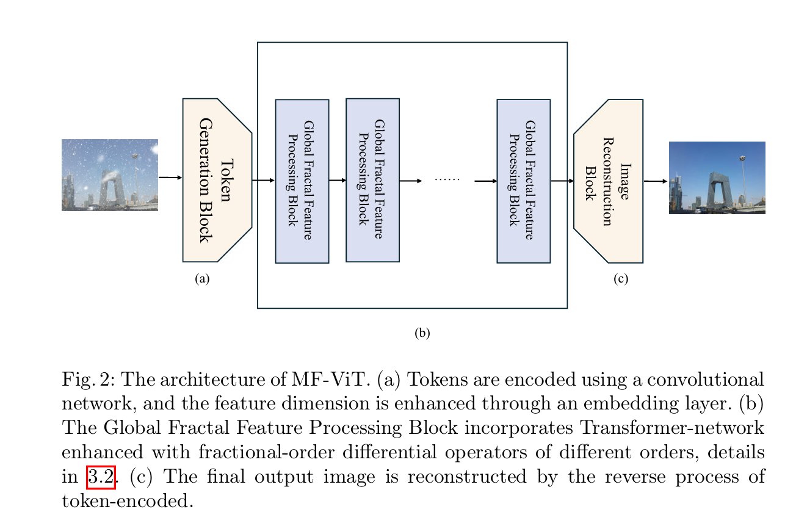
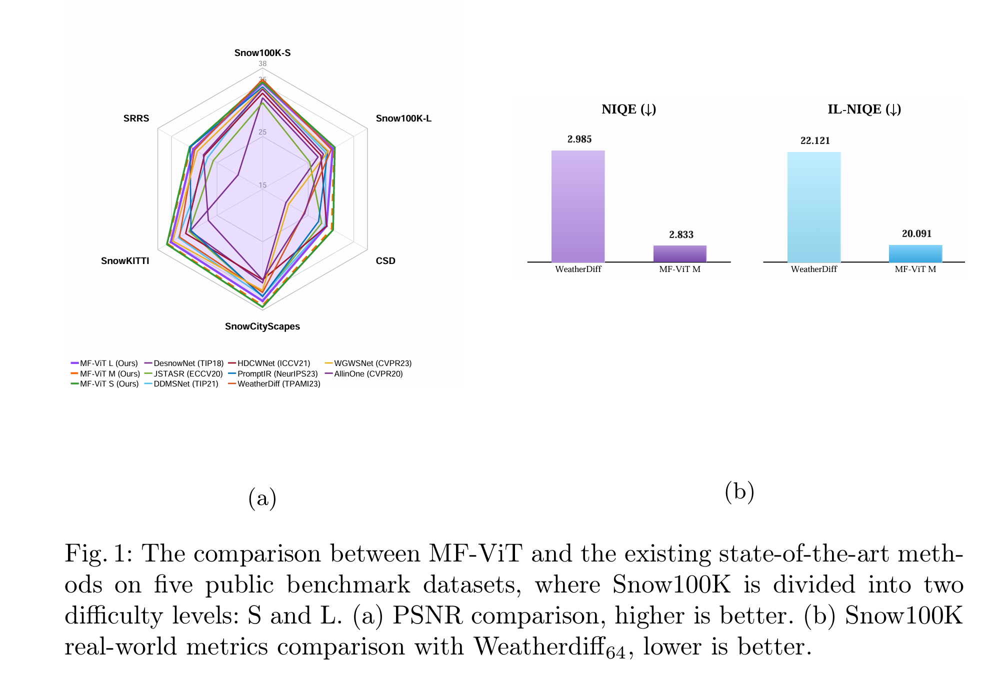

# Enhancing Vision Transformer with Multiple Fractional-Order Differential Operators for Image Desnowing  (Accepted at MMM 2026)

[](https://doi.org/10.21203/rs.3.rs-8011687/v1)
[](#)
[](#)
[](#)

> **Accepted at:** MMM 2026 (International Conference on Multimedia Modeling)
#### News

- **Nov 30, 2025:** Accepted at International Conference on Multimedia Modeling (**CORE B**, **CCF C**).
- **Dec 17, 2025:** code released.
  
This repository contains the **official code** for our MF‑ViT paper.


<hr />

> **Abstract:** *Image desnowing aims to eliminate the complex visual degradation caused by snowflake noise and is an important branch of image restoration. In this paper, we consider the self-similar complex edges and rough translucent structures of snowflake noise, which can be characterized by fractal dimension. We use multiple fractional-order differential operators to model fractals, thereby enhancing the Vision Transformer (ViT), and propose MF-ViT. MF-ViT is a dedicated deep learning desnowing model based on the specific prior modeling of the fractal features of snowflake noise. Specifically, to enhance fractal feature representation ability, we incorporate fractional differential operators of different orders into the attention and feedforward networks of ViT, which help to handle fractal features. We empirically evaluate the proposed MF-ViT on five benchmark public desnowing datasets. The results show that MF-ViT achieves state-of-the-art performance in both simulation and real-world images with snowflake noise. This paper also provides new model improvement ideas for other machine vision pattern analysis tasks with fractal dimension features.* 
<hr />

<hr />

## Network Architecture


## Main Results


## Datasets
We evaluate MF‑ViT on **five** public benchmark desnowing datasets:

| Task | Dataset | Notes | Reference |
|:--|:--|:--|:--|
| Image Desnowing | Snow100K | Includes synthetic levels (S/M/L) + real-world subset | [DS1] |
| Image Desnowing | CSD | Complex snow degradation | [DS2] |
| Image Desnowing | SnowCityScapes | Driving/urban scenes | [DS3] |
| Image Desnowing | SnowKITTI | Driving scenes (KITTI-like) | [DS4] |
| Image Desnowing | SRRS | Snow removal benchmark | [DS5] |

> Please follow the original dataset licenses/terms when downloading and using these datasets.


---

## Get Started

### Dependencies
Recommended environment:
- Python >= 3.9
- PyTorch >= 1.10 (or newer)

Typical Python packages:
- numpy, opencv-python, scikit-image, tqdm, einops, pyyaml, etc.

### Installation
```bash
git clone https://github.com/yuxuanliusydau-ai-mm/MFViT.git
cd MFViT

conda create -n mfvit python=3.10 -y
conda activate mfvit

pip install -e.
```

---

## Train
Paired training: snowy input / clean target):
```bash
python scripts/train.py \
  --data-root /path/to/DATA_ROOT \
  --variant mfvit-m \
  --resize-to 512 \
  --crop-size 224 \
  --amp

```

---

## Test / Inference
```bash
python scripts/infer.py \
  --ckpt runs/mfvit/best.pt \
  --input /path/to/img_or_folder \
  --output /path/to/out \
  --amp

```

---

## Citation
Please consider citing this work if you find it helpful:

```bibtex
@misc{li2025mfvit,
  title   = {Enhancing Vision Transformer with Multiple Fractional-Order Differential Operators for Image Desnowing},
  author  = {Yuxuan Li and Yuning Ren},
  year    = {2025},
  note    = {Research Square Preprint. Accepted at MMM 2026 (International Conference on Multimedia Modeling)},
  doi     = {10.21203/rs.3.rs-8011687}
}
```

---

## Dataset References
- [DS1] Liu, Y.-F., Jaw, D.-W., Huang, S.-C., Hwang, J.-N. **DesnowNet: Context-aware deep network for snow removal.** *IEEE Transactions on Image Processing*, 2018. DOI: 10.1109/TIP.2018.2806202  
- [DS2] Chen, W.-T., Fang, H.-Y., Hsieh, C.-L., Tsai, C.-C., Chen, I.-H., Ding, J.-J., Kuo, S.-Y. **ALL snow removed: Single image desnowing algorithm using hierarchical dual-tree complex wavelet representation and contradict channel loss.** *ICCV*, 2021. DOI: 10.1109/ICCV48922.2021.00416   
- [DS3] Zhang, K., Li, R., Yu, Y., Luo, W., Li, C. **Deep dense multi-scale network for snow removal using semantic and depth priors.** *IEEE Transactions on Image Processing*, 2021. DOI: 10.1109/TIP.2021.3104166
- [DS4] Zhang, K., Li, R., Yu, Y., Luo, W., Li, C. **Deep dense multi-scale network for snow removal using semantic and depth priors.** *IEEE Transactions on Image Processing*, 2021. DOI: 10.1109/TIP.2021.3104166  
- [DS5] Chen, W.-T., Fang, H.-Y., Ding, J.-J., Tsai, C.-C., Kuo, S.-Y. **JSTASR: Joint size and transparency-aware snow removal algorithm based on modified partial convolution and veiling effect removal.** *ECCV*, 2020. DOI: 10.1007/978-3-030-58589-1_45  

---

## Contact
If you have any questions, please contact:
- **Yuxuan Li**: yuxuan.li.usyd.au@gmail.com

- **Support for multi-GPU and multi-node distributed training (DDP) is under development and will be released in a future update.**


---

## Acknowledgment
- The token generation / reconstruction design is inspired by transformer-based image/video restoration token pipelines.
- We thank the authors of the benchmark datasets used in this work.
